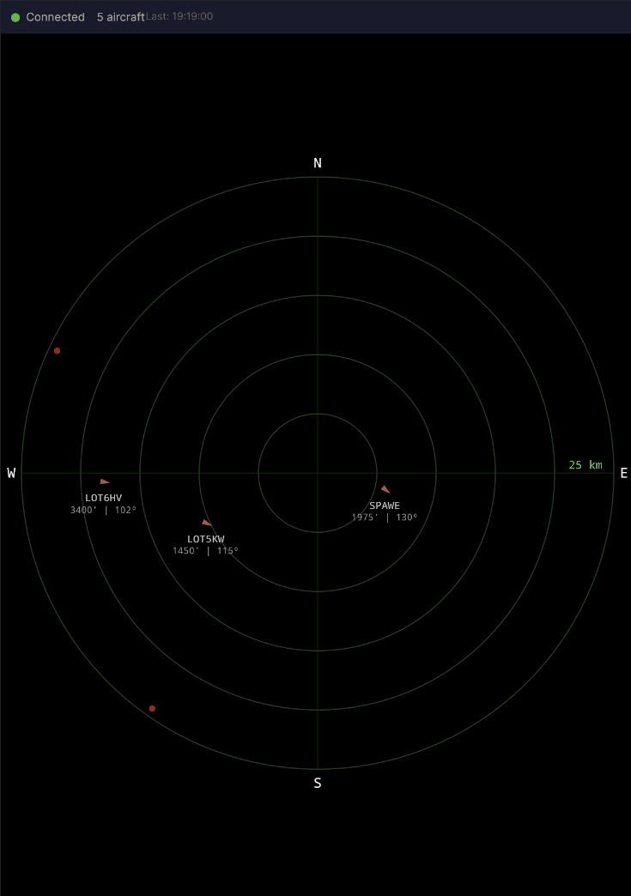
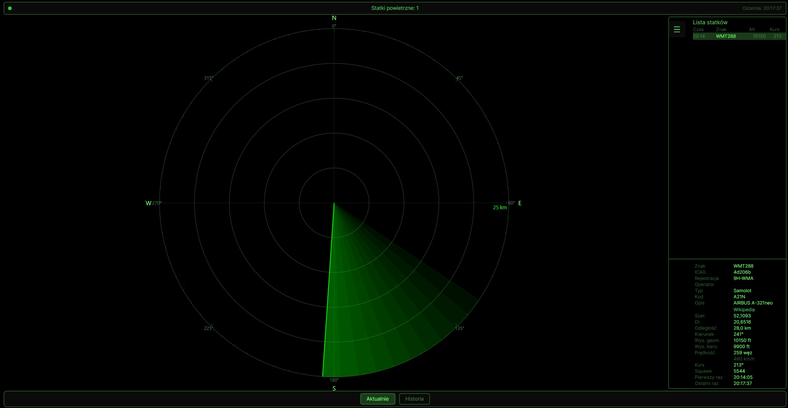
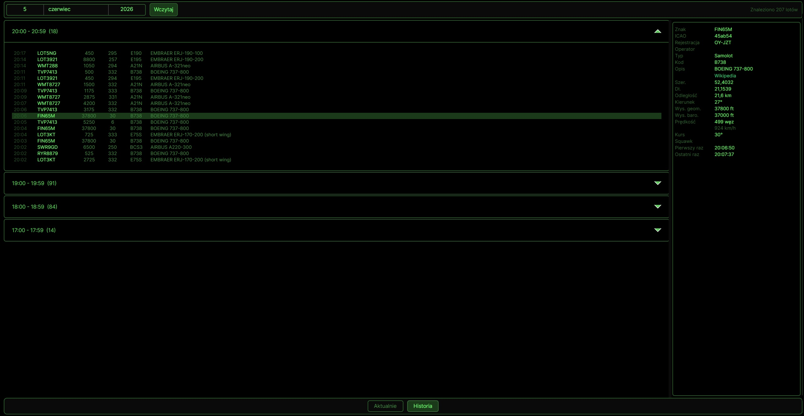

# FlightRadar

Okrągły radar lotniczy na żywo pokazujący statki powietrzne w okolicy twojego domu. Zbudowany w .NET 10 + Avalonia UI. Styl retro green-CRT inspirowany filmami z lat 80. (War Games, Firefox).



## Działanie

Backend cyklicznie polluje publiczne API [adsb.fi](https://opendata.adsb.fi/) i pushuje dane do klienta przez SignalR. `AircraftTracker` śledzi historię aircraftów między pollami — timestampy pierwszego/ostatniego pojawienia oraz 30-sekundowy ghost dla aircraftów które zniknęły z zasięgu API.

Radar rysowany jest na Canvas z użyciem Avalonia DrawingContext — koncentryczne pierścienie co 5 km, maksymalny zasięg 25 km. Samoloty poza zasięgiem (ale w zasięgu fetcha API) pokazywane są jako zielone kropki na krawędzi radaru.

**Sweep** — obracająca się linia symulująca skanowanie radarowe. Po przejściu sweepa przez pozycję aircrafta, ikona pojawia się i stopniowo zanika (efekt phosphor glow). Prędkość obrotu ~2.7s/obrót, czas zanikania ~2.5s.

**Side Panel** — składany panel boczny (SplitView CompactInline, prawa strona) z Aircraft Table (listą wszystkich aircraftów) i sekcją szczegółów po kliknięciu wiersza. W trybie zwiniętym pokazuje tylko ikonę (48px), po rozwinięciu zajmuje 260px wypychając radar.

**Ekran szczegółów** — po kliknięciu aircrafta w Side Panel, dolna sekcja pokazuje pełne informacje: callsign, ICAO, rejestrację, operatora, typ, pozycję, odległość, prędkość, kurs.



**Historia** — tryb przeglądania zapisanych Flight Records. Lista godzinowa z expandermi,每个 wiersz pokazuje czas, callsign, altitude, heading, typ i opis. Po wybraniu rekordu szczegóły pojawiają się w panelu bocznym.



## Styl wizualny

Aplikacja używa stylizacji retro green-CRT na czarnym tle:

- Tło: czarne (`#000000`)
- Tekst i ramki: odcienie zieleni (`#80FF80`, `#4a8a4a`, `#2a5a2a`)
- Ikony aircraftów: zielone (samolot `#00FF80`, helikopter `#00CC60`)
- Radar: czarne tło z zielonymi ringami, tickami, etykietami N/S/E/W
- Sweep: jasna zieleń z gradientową poświatą
- Przyciski: zielone obramowanie, aktywne wypełnione ciemną zielenią
- Status bar: zielone diody (orange/red dla stanów ostrzegawczych)

## Uruchomienie

### Docker (zalecane)

```bash
docker run -d -p 8081:8080 \
  -e RADAR_LAT=52.2297 \
  -e RADAR_LON=21.0122 \
  ghcr.io/twoja-organizacja/dotnet-flightradar:latest
```

### Lokalnie (rozwój)

```bash
# 1. Zbuduj WASM
dotnet build src/FlightRadar.UI.Web

# 2. Skopiuj do wwwroot
robocopy src/FlightRadar.UI.Web/bin/Debug/net10.0/browser-wasm/AppBundle src/FlightRadar.Server/wwwroot /E

# 3. Uruchom serwer na porcie 8080
dotnet run --project src/FlightRadar.Server

# Przejdź do http://localhost:8080
```

### Desktop (debugowanie)

```bash
dotnet run --project src/FlightRadar.UI.Desktop
```

### docker-compose

```bash
docker compose up -d
```

## Zmienne środowiskowe

| Zmienna | Domyślnie | Opis |
|---|---|---|
| `RADAR_LAT` | `52.2297` | Szerokość geograficzna środka radaru |
| `RADAR_LON` | `21.0122` | Długość geograficzna środka radaru |
| `POLL_INTERVAL_SECONDS` | `5` | Interwał odpytywania API ADS-B |
| `RADAR_RANGE_KM` | `25` | Maksymalny zasięg radaru (ostatni pierścień) |
| `ADSB_API_BASE_URL` | `https://opendata.adsb.fi/api/v3` | Źródło danych ADS-B |

## Struktura projektu

```
src/
  FlightRadar.Shared/       — DTO (AircraftData, RadarState)
  FlightRadar.Server/       — ASP.NET Core + SignalR + AdsbPoller + AircraftTracker
  FlightRadar.UI/           — Core Avalonia (widoki, viewmodele, canvas, konwertery)
  FlightRadar.UI.Web/       — WASM head (przeglądarka)
  FlightRadar.UI.Desktop/   — Desktop head (Windows/Linux/macOS)
```

## Technologie

- .NET 10, C#
- Avalonia UI 11.3 (FluentTheme, SplitView, DrawingContext, custom ControlTheme)
- SignalR (push danych)
- CommunityToolkit.Mvvm (source generators)
- adsb.fi open data API
- Retro green-CRT styling (nadpisanie FluentTheme)
- Radar sweep effect (DispatcherTimer, StreamGeometry, opacity fade)
